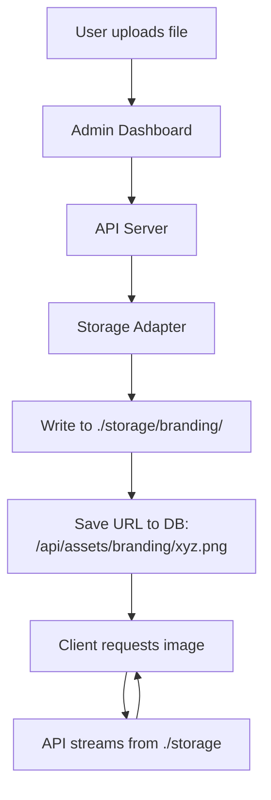
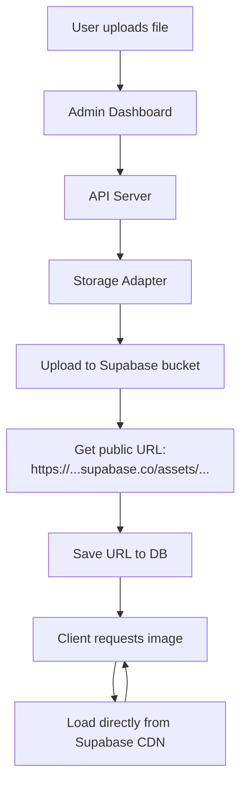

# Storage Comparison: Local vs Supabase

## Overview

Your application supports two storage modes for uploaded images (logos, catalog icons, etc.):

1. **Local Storage** (default) - Files stored on server disk
2. **Supabase Storage** (recommended) - Files stored in cloud with CDN

---

## Side-by-Side Comparison

| Aspect | Local Storage | Supabase Storage |
|--------|--------------|------------------|
| **Configuration** | None (default) | 3 env vars required |
| **Setup Time** | 0 minutes | 5 minutes |
| **Storage Location** | `./storage` folder | Supabase cloud bucket |
| **File Persistence** | ❌ Lost on deploy/redeploy | ✅ Permanent |
| **Multi-Server** | ❌ No (single server only) | ✅ Yes (shared storage) |
| **CDN** | ❌ No | ✅ Yes (fast global delivery) |
| **Bandwidth** | Your server's bandwidth | 2 GB/month free |
| **Backups** | Manual | ✅ Automatic |
| **Scalability** | Limited by disk space | Unlimited |
| **Cost** | Free | Free tier (1 GB), then $25/mo |

---

## Upload Flow Comparison

### Local Storage Flow



**Key Points:**
- File saved to disk at `e:\Weyouprod\storage\branding\filename.png`
- Database stores relative URL: `/api/assets/branding/filename.png`
- API serves file by reading from disk and streaming to client
- If server restarts or redeploys, files are lost
- Each server needs its own storage (doesn't scale horizontally)

---

### Supabase Storage Flow



**Key Points:**
- File uploaded to Supabase cloud storage
- Database stores full Supabase URL
- Images load directly from Supabase CDN (bypasses your API)
- Files persist across server restarts and deploys
- Works with multiple servers/load balancers

---

## Code-Level Differences

### Environment Variables

**Local Storage (.env):**
```env
STORAGE_DRIVER=local
LOCAL_STORAGE_ROOT=./storage
```

**Supabase Storage (.env):**
```env
# STORAGE_DRIVER=local        # commented out
# LOCAL_STORAGE_ROOT=./storage

SUPABASE_URL="https://lgykizwycdkfkwxidpro.supabase.co"
SUPABASE_SERVICE_ROLE_KEY="eyJhbGciOiJIUzI1NiIsInR5cCI6IkpXVCJ9..."
SUPABASE_STORAGE_BUCKET="assets"
```

---

### Storage Adapter Selection

The application automatically chooses the right adapter based on env vars:

```typescript
// apps/api/src/infra/infra.module.ts
const storageAdapter = 
  process.env.SUPABASE_SERVICE_ROLE_KEY &&
  process.env.SUPABASE_URL &&
  process.env.SUPABASE_STORAGE_BUCKET
    ? new SupabaseStorageAdapter({     // Cloud storage
        url: process.env.SUPABASE_URL,
        serviceRoleKey: process.env.SUPABASE_SERVICE_ROLE_KEY,
        bucket: process.env.SUPABASE_STORAGE_BUCKET,
      })
    : new LocalStorageAdapter({         // Local disk storage
        root: process.env.LOCAL_STORAGE_ROOT || './storage',
      });
```

---

### Upload Result Comparison

When you upload a logo, here's what gets saved to the database:

**Local Storage:**
```json
{
  "logoUrl": "/api/assets/branding/1743123456789-company-logo.png"
}
```

**Supabase Storage:**
```json
{
  "logoUrl": "https://lgykizwycdkfkwxidpro.supabase.co/storage/v1/object/public/assets/branding/1743123456789-company-logo.png"
}
```

---

## Image Access Patterns

### Local Storage

```
Browser Request: GET /api/assets/branding/logo.png
                    ↓
              API Controller (AssetsBrandingController)
                    ↓
              AssetsService.getCatalogIconStream()
                    ↓
              LocalStorageAdapter.getObjectStream()
                    ↓
              Read from: ./storage/branding/logo.png
                    ↓
              Stream back to browser
```

**Pros:**
- Simple, no external dependencies
- Works offline

**Cons:**
- Adds load to your API server
- Slower (no CDN)
- Files lost on redeploy

---

### Supabase Storage

```
Browser Request: GET https://...supabase.co/assets/branding/logo.png
                    ↓
              Supabase CDN (edge location)
                    ↓
              Supabase Storage Bucket
                    ↓
              Direct file delivery
```

**Pros:**
- Fast (CDN caching)
- No load on your API
- Always available
- Automatic backups

**Cons:**
- Requires internet connection
- External dependency

---

## Real-World Impact

### Scenario 1: Deploying Updates

**Local Storage:**
```bash
$ git push && vercel deploy
→ New deployment created
→ ./storage folder is EMPTY
→ All uploaded logos/icons are GONE
→ Need to re-upload everything
```

**Supabase Storage:**
```bash
$ git push && vercel deploy
→ New deployment created
→ Images still in Supabase bucket
→ Everything works immediately
→ Zero downtime
```

---

### Scenario 2: Scaling to Multiple Servers

**Local Storage:**
```
Load Balancer
    ├─→ Server 1 (has logo.png)
    ├─→ Server 2 (MISSING logo.png) ❌
    └─→ Server 3 (MISSING logo.png) ❌
```

Users get different experience depending on which server handles their request.

**Supabase Storage:**
```
Load Balancer
    ├─→ Server 1 ─┐
    ├─→ Server 2 ─┼─→ All access same Supabase bucket
    └─→ Server 3 ─┘    → Consistent experience
```

---

### Scenario 3: Performance

**Local Storage:**
```
User in India → Server in US → Read from disk → Stream to India
Latency: ~200-300ms
```

**Supabase Storage:**
```
User in India → CDN edge in Mumbai → Instant delivery
Latency: ~20-50ms (10x faster!)
```

---

## Migration Path

### From Local to Supabase

1. **Keep current setup** (don't delete local storage yet)
2. **Set up Supabase** (create bucket, add env vars)
3. **Restart API**
4. **Test with new uploads**:
   - Upload a test logo
   - Verify it shows Supabase URL
   - Check it loads from CDN
5. **Re-upload important assets**:
   - Brand logo
   - App icon
   - Key catalog items
6. **Monitor for a week**
7. **Optional:** Remove local storage config

### Rollback Plan

If Supabase doesn't work:

```env
# Comment out Supabase
# SUPABASE_URL=...
# SUPABASE_SERVICE_ROLE_KEY=...
# SUPABASE_STORAGE_BUCKET=...

# Re-enable local
STORAGE_DRIVER=local
LOCAL_STORAGE_ROOT=./storage
```

Old local files will still work if they exist in `./storage`.

---

## Cost Analysis

### Local Storage
- **Monthly cost:** $0
- **Hidden costs:** Server disk space, backup management, manual maintenance

### Supabase Storage
- **Free tier:** 1 GB storage + 2 GB/month bandwidth
- **Pro plan:** $25/month for 100 GB + 25 GB bandwidth
- **Overage:** $0.08/GB additional storage

**Example:**
- 1000 catalog items with icons (~50 KB each) = 50 MB
- Logo + app icon + UPI QR = ~5 MB  
- Carousel images (3 × 200 KB) = 600 KB
- **Total:** ~56 MB (well within free tier!)

---

## Recommendation

### Use Local Storage For:
- ✅ Development/testing
- ✅ Demo environments
- ✅ Single-server setups where data loss is acceptable

### Use Supabase Storage For:
- ✅ Production environments
- ✅ Any app with real users
- ✅ Multi-server deployments
- ✅ Apps needing fast global performance
- ✅ Teams without dedicated DevOps

**Bottom line:** For any production use, **Supabase Storage is worth it**. The 5-minute setup saves hours of troubleshooting and prevents data loss.

---

## Quick Switch Guide

To switch from local to Supabase:

1. Edit `.env`:
   ```env
   # Comment these out
   # STORAGE_DRIVER=local
   # LOCAL_STORAGE_ROOT=./storage
   
   # Add these
   SUPABASE_URL="https://YOUR_PROJECT.supabase.co"
   SUPABASE_SERVICE_ROLE_KEY="your-key-here"
   SUPABASE_STORAGE_BUCKET="assets"
   ```

2. Restart API: `npm run dev:api`

3. Test: Upload a logo in admin dashboard

4. Verify: Check database for Supabase URL

**That's it!** 🎉

---

## Learn More

- **Full setup guide:** `docs/SUPABASE-STORAGE-SETUP.md`
- **Quick reference:** `docs/SUPABASE-QUICK-REFERENCE.md`
- **Database setup:** `docs/supabase.md`
